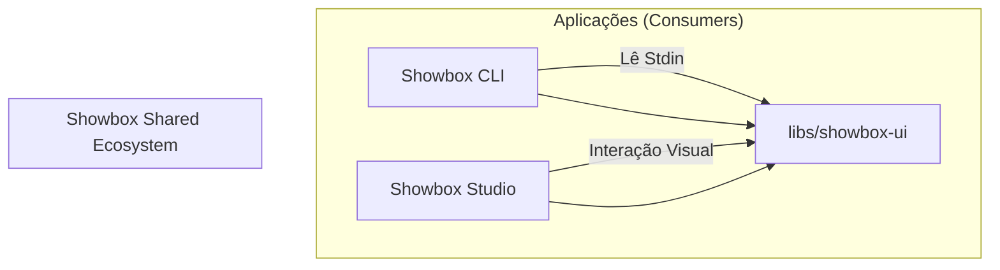

# Estratégia de Refatoração Showbox 2026: Arquitetura Orientada a Studio

> **Status:** Em Progresso (Fase Híbrida)
> **Data:** 14 de Janeiro de 2026
> **Objetivo:** Elevar a qualidade de código (Premium Code Quality) e permitir a criação do Showbox Studio através do desacoplamento do núcleo.

---

## 1. Visão Geral da Arquitetura

Para permitir que o **Showbox Studio** e o **Showbox CLI** coexistam com 100% de paridade visual e funcional, o código monolítico atual será refatorado em uma arquitetura de camadas baseada em **Biblioteca Compartilhada**.

### O Conceito "Core Library"

O código fonte será reorganizado para isolar a lógica de UI da lógica de parsing de texto.



---

## 2. Estratégia de Build Híbrida (Legado + Moderno)

Para manter a compatibilidade com o sistema de empacotamento existente (`packaging/deb`, `packaging/rpm`, etc.), adotamos uma abordagem de build duplo durante a transição:

1.  **Build Legado (QMake):**
    *   Mantido em `src/code/showbox/showbox.pro`.
    *   Configurado para incluir arquivos fonte (`SOURCES`) e cabeçalhos (`HEADERS`) diretamente da pasta `libs/showbox-ui` usando caminhos relativos (`../../../libs/...`).
    *   **Garante:** Que os pacotes `.deb`, `.rpm`, `.AppImage` continuem sendo gerados sem alteração nos scripts de CI/CD.

2.  **Build Moderno (CMake):**
    *   Configurado na raiz (`CMakeLists.txt`) e em `libs/showbox-ui`.
    *   Trata `showbox-ui` como uma biblioteca estática real.
    *   Usado para o desenvolvimento do **Showbox Studio** e testes unitários.

---

## 3. Log de Migração de Componentes

Este registro rastreia quais componentes foram movidos do monólito (`src/code/showbox`) para a biblioteca (`libs/showbox-ui`).

| Componente | Data | Motivo da Migração | Dependências |
| :--- | :--- | :--- | :--- |
| **IconHelper** | 14/01/2026 | Utilitário independente necessário para UI. | `Logger` (Moveu junto) |
| **Logger** | 14/01/2026 | Dependência direta de `IconHelper` e usada globalmente. | Nenhuma (Qt Core) |

---

## 4. Design Patterns Adotados

### 4.1. Builder Pattern (O Coração da Construção)

Atualmente, o Showbox constrói widgets "on-the-fly" enquanto lê o texto. Isso impede o Studio de instanciar um widget sem simular um arquivo de texto.

**Solução:** Implementar o `ShowboxBuilder`.

*   **Intenção:** Separar a construção de um objeto complexo da sua representação.
*   **Aplicação:**
    *   O CLI lê `add pushbutton "OK" btn_ok` -> Chama `builder->createButton("OK", "btn_ok")`.
    *   O Studio recebe um Drag & Drop -> Chama `builder->createButton("OK", "btn_ok")`.
*   **Benefício:** Garante que a inicialização de propriedades, estilos padrão e conexões de sinais internos sejam idênticas em ambos os apps.

### 4.2. Passive View (MVP - Model View Presenter)

Os Widgets Qt atuais contêm lógica de execução de shell script (ex: `system()`, `popen()`). Isso é uma violação do Princípio de Responsabilidade Única (SRP).

**Solução:** Tornar os Widgets "Passivos".

*   **View (Widget):** Apenas exibe dados e emite sinais Qt puros (`signal: clicked()`). Não sabe o que é "Shell Script".
*   **Presenter (Controller):**
    *   No **CLI**: O Presenter conecta `clicked()` a uma função que escreve no stdout ou executa um comando.
    *   No **Studio**: O Presenter conecta `clicked()` a uma função que seleciona o widget no Property Editor.

---

## 5. Estrutura de Diretórios Proposta

```text
/
├── CMakeLists.txt          # Build system mestre (Novo)
├── libs/
│   └── showbox-ui/         # A Biblioteca (Static/Shared Lib)
│       ├── include/        # Headers públicos (icon_helper.h, logger.h)
│       └── src/            # Implementação (icon_helper.cpp, logger.cpp)
├── src/
│   └── code/
│       └── showbox/        # Aplicação CLI (Legacy path mantido)
│           ├── showbox.pro # Build Legacy (Aponta para ../../../libs)
│           └── ...
└── apps/
    └── studio/             # O novo Editor (IDE)
```